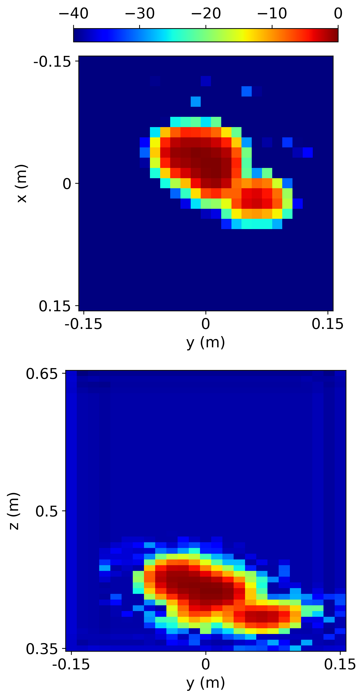

# STR-Net

*A Swin Transformer-based Reconstruction Framework for Near-Field Millimeter-Wave Radar Imaging*

---

## 🛰️ Overview

**STR-Net** is a deep learning framework for **near-field millimeter-wave radar imaging** based on a 3D Swin Transformer architecture.
It refines coarse reflectivity maps obtained from physics-based adjoint operations and reconstructs high-resolution images with improved structural fidelity.
The method is applicable to **security screening, through-wall sensing, and medical diagnostics**, where accurate and efficient 3D imaging is required.

---

## 🌟 Key Features & Contributions

* **3D SwinUNet Architecture** – Combines Swin Transformer and UNet-style encoder–decoder for efficient multi-scale feature modeling.
* **Multi-Scale Feature Fusion (MSF) Block** – Adaptively integrates features at different resolutions.
* **Multi-Dimensional Spatial Attention (MDSA) Module** – Captures spatial dependencies along depth, height, and width dimensions.
* **Hybrid Loss Function (MSE + L2)** – Balances reconstruction accuracy and smoothness while accelerating convergence.

---

## ⚙️ Installation

We recommend using a virtual environment.

```bash
git clone https://github.com/Meicarl/STR-Net.git
cd STR-Net
pip install -r requirements.txt
```

> 💡 For GPU users:
> Please install the matching PyTorch and CUDA versions from the [official PyTorch website](https://pytorch.org/) before running the above command.

---

## 🚀 Quick Start

Example of loading the pretrained model in Python:

```python
from strnet.models.STR_Net import STR_Net
import torch

model = STR_Net()
model.load_state_dict(torch.load('model/best.pt', map_location='cpu'))
model.eval()
```

Or run the demo notebook:

```bash
jupyter notebook r3d_show.ipynb
```

The notebook includes:

* Data loading and preprocessing
* Model loading and inference
* Visualization of reconstructed radar images

---

## 🧩 Data & Model

* Example data (`.npy`) is included in the `data/` folder.
* Pretrained weights can be downloaded from the following link and placed in the `model/` directory:
  🔗 [Quark Cloud Link](https://pan.quark.cn/s/0e3248f46240)

> For custom datasets, refer to `strnet/datasets/` for data loading templates.

---

## 📓 Demo Example

After running the notebook, you will see a visualization similar to:

| Initial Physics-Based Reconstruction |     STR-Net Enhanced Result    |
| :----------------------------------: | :----------------------------: |
|        |        |
|        |        |


---

## 📁 Project Structure

```
STR-Net/
├── strnet/                 # Core package
│   ├── blocks/             # Basic convolution and UNet modules
│   ├── models/             # 3D Swin Transformer model implementations
│   ├── datasets/           # Dataset loading and processing tools
│   ├── losses/             # Loss functions
│   └── utils/              # Visualization and utility functions
├── data/                   # Example data
├── model/                  # Pretrained model weights
├── r3d_show.ipynb          # Demonstration notebook
├── requirements.txt
└── LICENSE
```

---

## 📜 License

This project is released under the **MIT License**.
See the [LICENSE](./LICENSE) file for details.

---

## 📚 Citation

If you use this project or find it helpful in your research, please cite it as:

```
@article{STR-Net2025,
  title   = {STR-Net: A Swin Transformer-Based Reconstruction Framework for Near-Field Millimeter-Wave Radar Imaging},
  author  = {Jin, Shaohui and Zhao, Pengfei and Wei, Xinnian and Jiang, Xiaoheng and Zhang, Wenjie and Liu, Hao},
  journal = {Sensors},
  year    = {2025}
}
```